# CxHubSdk
Обертка для нативных SDK CxHub для использования с Flutter.

Важный момент: оригинальные нативные SDK CxHub предназначены для использования с аккаунтами Firebase/Huawei/Rustore и APNs клиента, 
само пуш-уведомление приходит на приложение клиента, после чего обрабатывается при помощи SDK CxHub, поэтому внедрение включает 
в себя модификацию нативных частей Flutter-приложения.

## Интеграция в приложение

### Зависимости
Добавьте следующий код в pubspec.yaml вашего проекта:

```yaml
dependencies:
  # ...
  cxhub_sdk: 0.0.1
#dependency_overrides:
#  cxhub_android: 0.0.1-huawei
#  cxhub_android: 0.0.1-rustore
# ...
```

Для использования дефолтной реализации пуш-уведомлений для Android через Firebase не требуется переопределения зависимостей. 

Для использования Huawei или Rustore уведомлений необходимо раскомментировать нужный пункт. 
То есть переход на нужную имплементацию для Android реализован как переопределение версии Android-модуля сдк.

Для iOS используется только APNs.


### Android

В android/app/src (исходный код Android-части вашего приложения) необходимо добавить json-ключ google-services.json, 
или agconnect-services.json в зависимости от того какие именно пуш-уведомления вы подключаете. 
Для использования rustore-имплементации такого файла не нужно.

В android/app/src/main/res/values необходимо добавить файл cxhub.xml следующего вида:

```xml
<?xml version="1.0" encoding="utf-8"?>
<resources>
    <string name="cxhub_resource_icon_id">[drawable-ресурс иконки сообщения]</string>
    <string name="cxhub_integration_id" translatable="false">[id итеграции из личного кабинета cxhub]</string>
    <string name="cxhub_application_secret" translatable="false">[секретный ключ интеграции из личного кабинета]</string>
    <string name="cxhub_api_host" translatable="false">[путь к вашему проекту cxhub, например https://mytest.cxhub.ru]/callback-service/</string>
    <bool name="cxhub_trust_all_certificates">true</bool>
</resources>
```

В android/build.gradle необходимо добавить следующие строки:

```groovy
buildscript{
  repositories {
    google() 
    mavenCentral()
    maven{
      url "https://developer.huawei.com/repo/" // для huawei
    }

    maven{
       url "https://artifactory-external.vkpartner.ru/artifactory/maven" // для rustore
    }
    //...
  }

  dependencies {
    classpath("com.google.gms:google-services:4.4.2") // для firebase
    classpath("com.huawei.agconnect:agcp:1.9.1.302") // для huawei
  }
}

//...

allprojects {
    repositories {
        google()
        mavenCentral()
        maven{
            url "https://developer.huawei.com/repo/" // для huawei
        }
        maven {
            url "https://artifactory-external.vkpartner.ru/artifactory/maven" // для rustore
        }
        //...
    }
}
```

Репозитории помеченные комментариями добавляются только в случае использования указанного в них транспорта.

В android/app/build.gradle необходимо добавить следующие строки:
```groovy
plugins {
    //...
    id "com.google.gms.google-services" // если используется firebase
    id "com.huawei.agconnect" // если используется huawei
    //...
}
```

Плагины помеченные комментариями добавляются только в случае использования указанного в них транспорта.


При сборке с плагином CxHubSdk в merged манифест Android-приложения добавляются следующие разрешения (руками добавлять не нужно):

```xml
    <uses-permission android:name="android.permission.WRITE_EXTERNAL_STORAGE" />
    <uses-permission android:name="android.permission.ACCESS_WIFI_STATE" />
    <uses-permission android:name="android.permission.READ_PHONE_STATE" />
    <uses-permission android:name="android.permission.POST_NOTIFICATIONS" />
    <uses-permission android:name="android.permission.READ_EXTERNAL_STORAGE" />
    <uses-permission android:name="android.permission.ACCESS_NETWORK_STATE" />
    <uses-permission android:name="android.permission.WAKE_LOCK" />
    <uses-permission android:name="com.google.android.c2dm.permission.RECEIVE" />
    <uses-permission android:name="android.permission.RECEIVE_BOOT_COMPLETED" />
    <uses-permission android:name="android.permission.FOREGROUND_SERVICE" />
```

### iOS

Для интеграции CxHubSdk в iOS-часть приложения, необходимо произвести следующие действия 

В общей части проекта: 
- установить\добавить во Flutter-проект плагин cxhub_sdk
- проверить, что в pubspec.yaml вашего проекта есть следуюший код:

```yaml
dependencies:
  # ...
  cxhub_sdk: 0.0.1
#dependency_overrides:
#  cxhub_android: 0.0.1-huawei
#  cxhub_android: 0.0.1-rustore
# ...
  cxhub_ios:
    hosted: https://onepub.dev/api/ndfuuhnofl/ # здесь должна быть ссылка на pub.dev
    version: ^0.0.4 #последняя актуальная версия
```

В платформенной части (.../ios), открыв workspace с помощью XCode:

- изменить\модифицировать настройки (вкладка "Signing & Capabilities") основного таргета:
  Добавить следующие "Capabilities":
  - App Groups (идентификатор общей группы должен соответствовать вашему приложению, он будет использован ниже и для extensions)
  - Communication Notifications
  - Push Notifications

  Далее:

  - Добавить "Capabilities"

  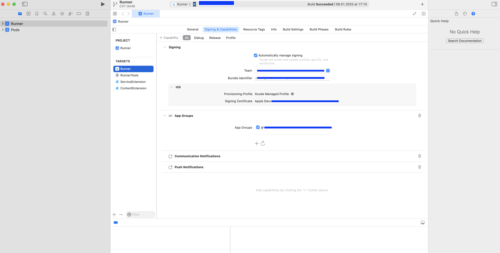

  - добавить 2 модуля-extension(s): NotificationService(Extension), ContentExtension

  Добавляем и конфигурируем NotificationService extension (добавляем новый таргет):
  - Добавить "NotificationService (extension)"
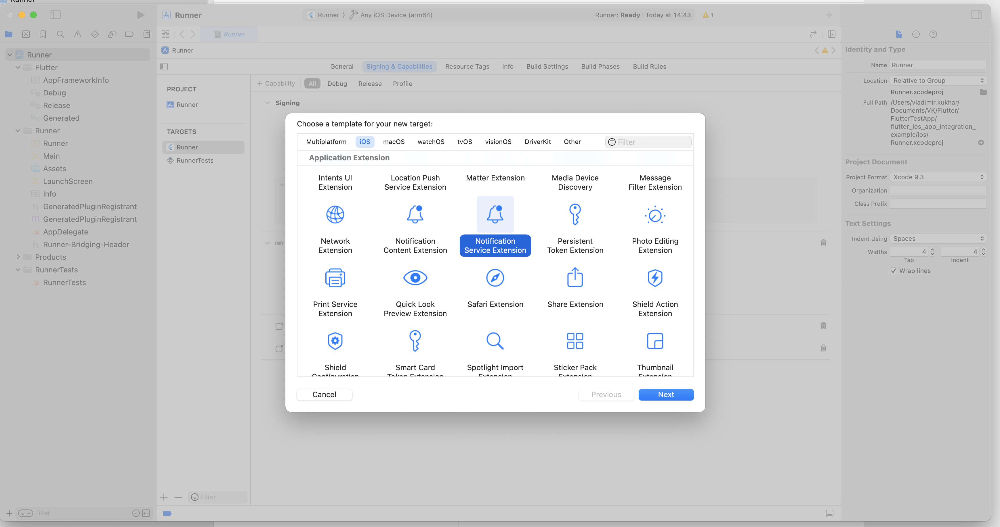

  - Задать имя "ServiceExtension"
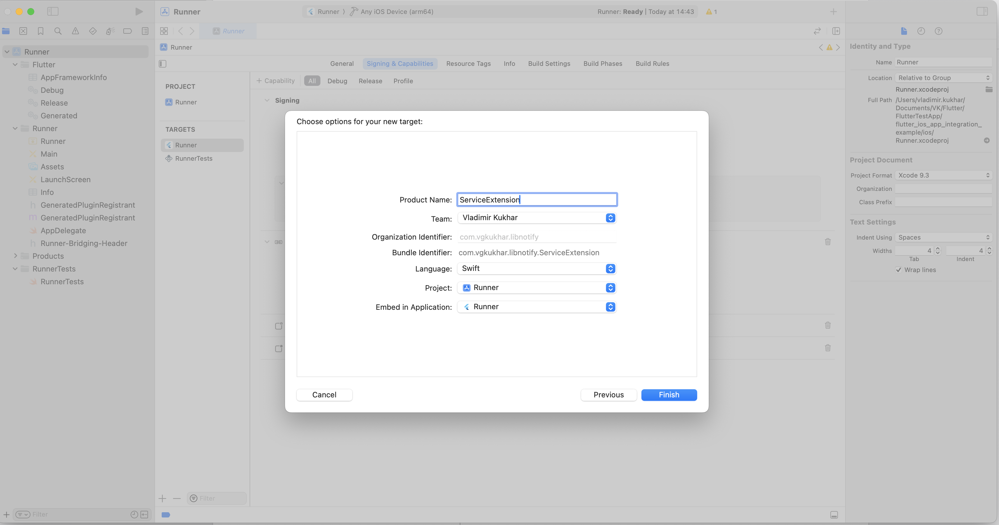

  - Активировать
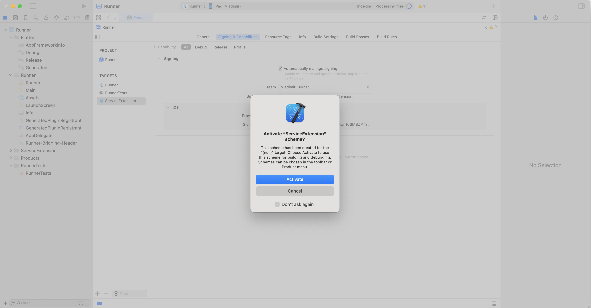

  - Добавить "Capabilities" для NotificationService
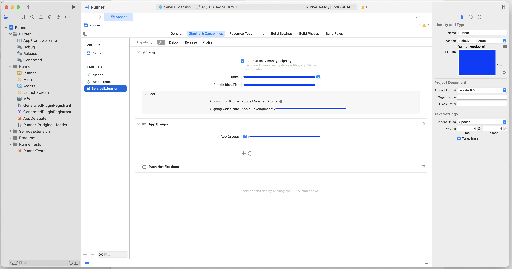

  Добавляем и конфигурируем ContentExtension (добавляем новый таргет):

  - Добавить "ContentExtension (extension)"
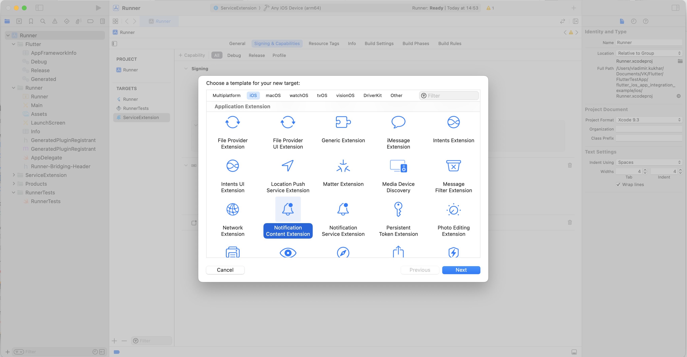

  - Задать имя "ContentExtension"
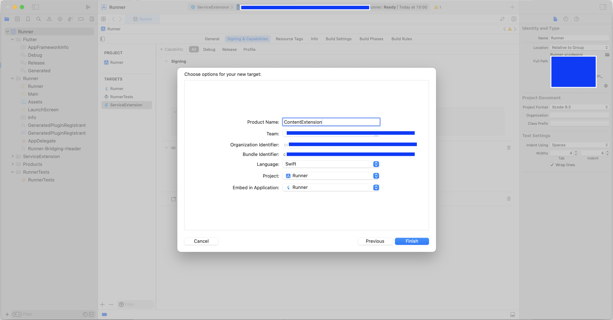

  - Активировать
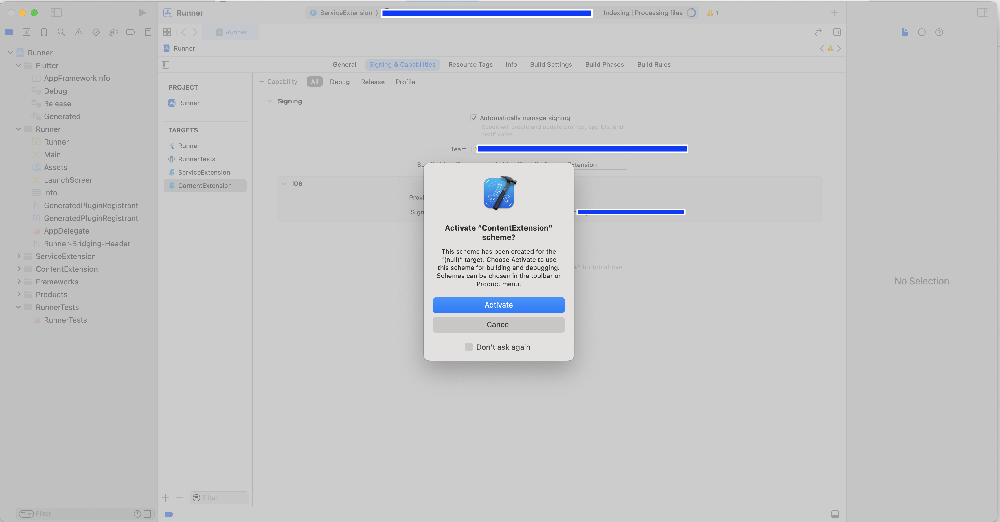

  - Добавить "Capabilities" для СontentExtension
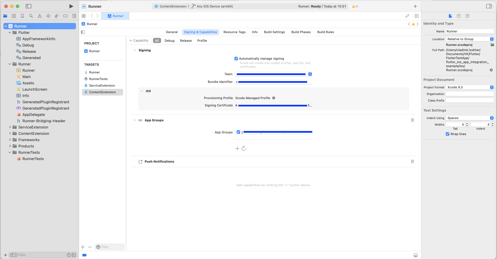

  Во всех модулях проекта и таргетов устанавливаем минимальную версию iOS >= 14.0 (это требование cxhub_sdk (ioS), которая использует iOS 14+):
  - Workspace deployment target
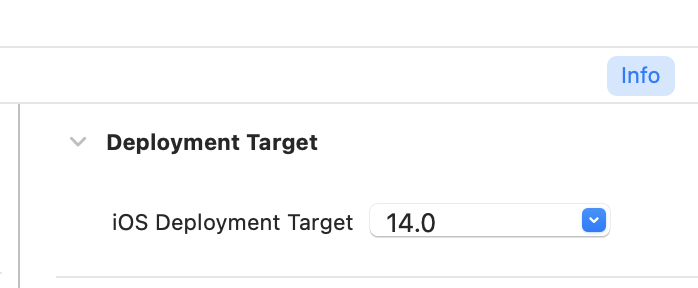
  - Extension minimum deployment
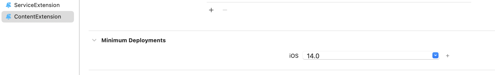

Далее переходим на основной таргет приложения, вкладка "Build Phases" и меняем последовательность фаз так, чтобы "Thin Binary" оказалась ниже(!) "Embed Foundation Extensions"

- Исходная последовательность:
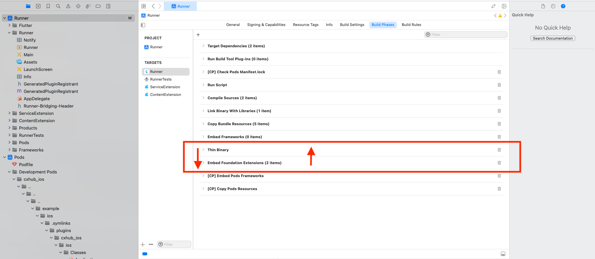

- Результат:
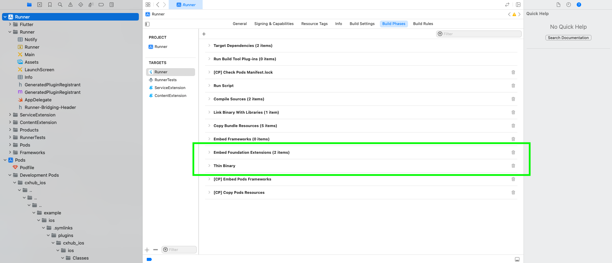

Далее:

- Добавляем в проект файл Notify.plist следующего вида:

```xml
<?xml version="1.0" encoding="UTF-8"?>
<!DOCTYPE plist PUBLIC "-//Apple//DTD PLIST 1.0//EN" "http://www.apple.com/DTDs/PropertyList-1.0.dtd">
<plist version="1.0">
<dict>
	<key>Enabled</key>
	<true/>
	<key>Debug</key>
	<true/>
	<key>LibNotify</key>
	<dict>
		<key>UNNotificationExtensionCategory</key>
		<array>
			<string>libnotify_default</string>
			<string>libnotify_button_queue_1</string>
			<string>libnotify_button_queue_2</string>
			<string>libnotify_button_queue_3</string>
			<string>libnotify_button_queue_4</string>
			<string>libnotify_button_queue_5</string>
		</array>
		<key>Activity</key>
		<dict>
			<key>Colors</key>
			<dict>
				<key>BackgroundColor</key>
				<dict>
					<key>Dark</key>
					<string>#030303</string>
					<key>Light</key>
					<string>#DDDDDD</string>
				</dict>
				<key>TextColor</key>
				<dict>
					<key>Dark</key>
					<string>#DDDDDD</string>
					<key>Light</key>
					<string>#030303</string>
				</dict>
				<key>AccentColor</key>
				<dict>
					<key>Dark</key>
					<string>#219653</string>
					<key>Light</key>
					<string>#219653</string>
				</dict>
				<key>ButtonTextColor</key>
				<dict>
					<key>Dark</key>
					<string>#70D098</string>
					<key>Light</key>
					<string>#70D098</string>
				</dict>
				<key>CloseButtonColor</key>
				<dict>
					<key>Dark</key>
					<string>#6FCF97</string>
					<key>Light</key>
					<string>#6FCF97</string>
				</dict>
				<key>DarkModeSupported</key>
				<true/>
			</dict>
			<key>FontType</key>
			<string>Custom</string>
		</dict>
		<key>Enabled</key>
		<true/>
		<key>Application</key>
		<dict>
			<key>ApiUrlHost</key>
			<string>*YOUR_CXHUB_PROJECT_URL*</string>
			<key>IntegrationId</key>
			<string>*YOUR_CXHUB_INTEGRATION_ID*</string>
			<key>Secret</key>
			<string>*YOUR_CXHUB_INTEGRATION_SECRET*</string>
		</dict>
	</dict>
	<key>SharedGroupId</key>
	<string>*YOUR_APPLE_SHARED_GROUP_ID*</string>
</dict>
</plist>
```

- модифицируем (заполняем своими параметрами) Root -> LibNotify -> Application:
 - ApiUrlHost: <базовый URL проекта в CxHub>/callback-service/  (пример: https://vgktest.cxhub.ru/callback-service/ )
 - IntegrationId: идентификатор интеграции в CxHub (получаем из настроек интеграции в Web интерфейсе личного кабинета CxHub)
 - Secret: секрет интеграции в CxHub (получаем из настроек интеграции в Web интерфейсе личного кабинета CxHub)

 - модифицируем (заполняем своими параметрами) Root -> SharedGroupId :  ваш идентификатор shared_group для приложения

*Важно*: параметр *Root -> Debug* по умолчанию установлен *True*, в релизной сборке приложения его необходимо установить *False*

Остальные параметры оставляем без изменений.

Файл *Notify.plist* описывает основные настройки для SDK, поэтому в "Target Membership" у него *обязательно* должен быть включены "галочки" для всех таргетов приложения (основной, ServiceExtension, ContentExtension)

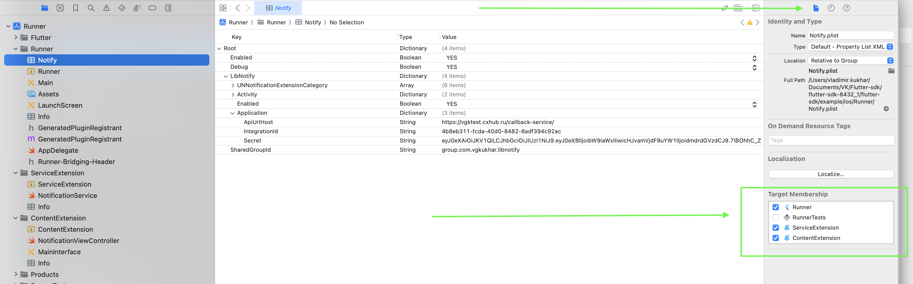

Далее модифицируем Appdelegate.swift (добавляем необходимые для работы SDK вызовы):

```swift

import Flutter
import UIKit
import cxhub_ios

@main
@objc class AppDelegate: FlutterAppDelegate {
    override func application(
        _ application: UIApplication,
        didFinishLaunchingWithOptions launchOptions: [UIApplication.LaunchOptionsKey: Any]?
    ) -> Bool {
        GeneratedPluginRegistrant.register(with: self)
        return super.application(application, didFinishLaunchingWithOptions: launchOptions)
    }
    
    override func application(_ application: UIApplication, didRegisterForRemoteNotificationsWithDeviceToken deviceToken: Data) {
        CxhubSdkPlugin.instance.application(application, didRegisterForRemoteNotificationsWithDeviceToken: deviceToken)
        return super.application(application, didRegisterForRemoteNotificationsWithDeviceToken: deviceToken)
    }
    
    override func application(_ application: UIApplication, didFailToRegisterForRemoteNotificationsWithError error: Error) {
        CxhubSdkPlugin.instance.application(application, didFailToRegisterForRemoteNotificationsWithError: error)
        return super.application(application, didFailToRegisterForRemoteNotificationsWithError: error)
    }
}

```

Добавляем\модифицируем NotificationService.swift:

```swift
import UserNotifications
import cxhub_ios
import CXHubCore
import CXHubNotify

class NotificationService: UNNotificationServiceExtension {
    
    var contentHandler: ((UNNotificationContent) -> Void)?
    var bestAttemptContent: UNMutableNotificationContent?
    private var apiIsInitialized :  Bool = false
    
    override init() {
        apiIsInitialized = CxhubSdkPlugin.initCXHubSDK()
    }
    
    override func didReceive(_ request: UNNotificationRequest, withContentHandler contentHandler: @escaping (UNNotificationContent) -> Void) {
        self.contentHandler = contentHandler
        bestAttemptContent = (request.content.mutableCopy() as? UNMutableNotificationContent)
        
        if let bestAttemptContent = bestAttemptContent {
            if apiIsInitialized {
                if CxhubSdkPlugin.didReceive(request, withContentHandler: contentHandler) {
                    return
                }
                else {
                    contentHandler(bestAttemptContent)
                }
            }
            
            else {
                contentHandler(bestAttemptContent)
            }
        }
    }
    
    override func serviceExtensionTimeWillExpire() {
        if let contentHandler = contentHandler, let bestAttemptContent =  bestAttemptContent {
            if apiIsInitialized {
                if CxhubSdkPlugin.serviceExtensionTimeWillExpire() {
                    return
                }
                else {
                    contentHandler(bestAttemptContent)
                }
            }
            
            else {
                contentHandler(bestAttemptContent)
            }
        }
    }
    
}
```

Модифицируем NotificationViewController.swift (модуль\папка ContentExtension):

```swift

import UIKit
import UserNotifications
import UserNotificationsUI
import cxhub_ios
import CXHubNotify

class NotificationViewController: UIViewController, UNNotificationContentExtension {
    
    private var apiIsInitialized :  Bool = false

    @IBOutlet var bigContentImage: UIImageView!
    
    override func awakeFromNib() {
        super.awakeFromNib()
        apiIsInitialized = CxhubSdkPlugin.initCXHubSdkWithContentExtensionImage(bigImage: self.bigContentImage)
    }
    
    override func viewDidLoad() {
        super.viewDidLoad()
        // Do any required interface initialization here.
    }
    
    func didReceive(_ notification: UNNotification) {
        self.label?.text = notification.request.content.body
    }
    
    func didReceive(_ notification: UNNotification) {
        //This variant is for CxhubSdkPlugin as CXContentExtensionDelegate
        let processed = apiIsInitialized && CxhubSdkPlugin.instance.didReceive(notification)
        
        if (!processed) {
            //Do some custom logic with a particular notification as it is not originated from CXHubSDK API.
        }
        
    }
    
    func didReceive(_ response: UNNotificationResponse, completionHandler completion: @escaping (UNNotificationContentExtensionResponseOption) -> Void) {
        if apiIsInitialized {
            if !CxhubSdkPlugin.instance.didReceive(response, context: self.extensionContext, completionHandler: completion) {
                //Catch action with UNNotificationContentExtensionResponseOption yourself
            }
        }
        else {
            //Catch action with UNNotificationContentExtensionResponseOption yourself, cause CXHubSDK wasn't initialized correctly
        }
    }
    
}

```

Файл Info.plist для ContentExtension модифицируем следующим образом:

```xml

<?xml version="1.0" encoding="UTF-8"?>
<!DOCTYPE plist PUBLIC "-//Apple//DTD PLIST 1.0//EN" "http://www.apple.com/DTDs/PropertyList-1.0.dtd">
<plist version="1.0">
<dict>
	<key>NSExtension</key>
	<dict>
		<key>NSExtensionAttributes</key>
		<dict>
			<key>UNNotificationExtensionCategory</key>
			<array>
				<string>libnotify_default</string>
				<string>libnotify_button</string>
				<string>libnotify_button_queue_1</string>
				<string>libnotify_button_queue_2</string>
				<string>libnotify_button_queue_3</string>
				<string>libnotify_button_queue_4</string>
				<string>libnotify_button_queue_5</string>
			</array>
			<key>UNNotificationExtensionInitialContentSizeRatio</key>
			<integer>0</integer>
		</dict>
		<key>NSExtensionMainStoryboard</key>
		<string>MainInterface</string>
		<key>NSExtensionPointIdentifier</key>
		<string>com.apple.usernotifications.content-extension</string>
	</dict>
</dict>
</plist>


```
Кроме этого в ContentExtension добавляем UIImageView на View для NotificationViewController в MainInterface.storyboard, устанавливаем для него необходимые constraints, и связываем его со свойством *bigContentImage*:

пример:

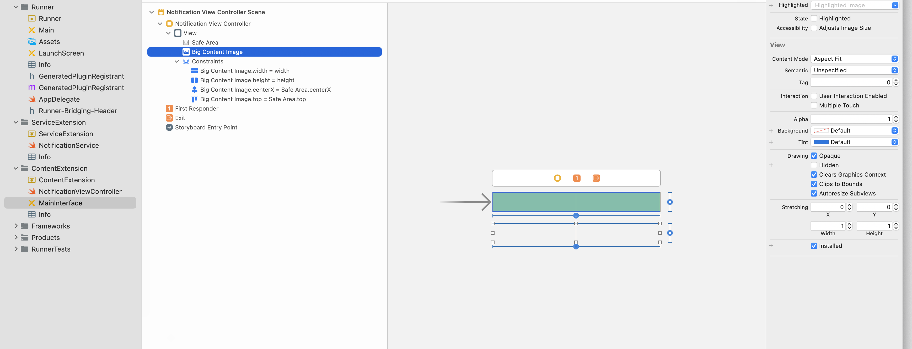


### Инициализация
Для инициализации сдк с использованием Firebase или Huawei добавьте следующий код в функцию main:

```dart
CxHubSdk.init();
```

В случае использования Rustore:

```dart
CxHubSdk.init("[yourRustoreProjectId]");
```

Для минимального функционала (прием пушей) этого достаточно. 

## API
Апи представлено одним статическим интерфейсом "CxHubSdk".

### Методы:

```dart
static void init({String? param});
```
Инициализация. Может принимать идентификатор проекта RuStore, если используются пуши RuStore.


```dart
static Future<String?> getMobileInstance();
```
Геттер мобильного инстанса. Возвращает сгенерированный SDK мобильный идентификатор клиента.


```dart
static Future<String?> getPushToken();
```
Геттер пуш-токена. Возвращает пуш-токен, выданный системой доставки пуш-уведомлений.


```dart
static Stream<String?> subscribeToPushToken();
```
Подписка на пуш-токен. В системах доставки пуш-уведомлений случается обновление токена.
При этом в возвращаемый поток эмитится новое значение. При подписке эмитится текущее значение токена.


```dart
static Future<MapEntry<String, String>?> getUserId();
```
Геттер идентификатора юзера. Идентификатор юзера - пользовательская настройка. Опциональна.
Пользователь может быть идентифицирован одним из уникальных значений предоставляемых им личных данных,
по совместному решению разработчика приложения и оператора ЛК CxHub.
Например, это почта или телефон. Ключом в возвращаемом MapEntry является тип этого значения, например Phone или Email.
Другие типы пользовательских параметров можно посмотреть, а так же добавить в личном кабинете CxHUb в разделе "пользовательские параметры".
В значении MapEntry содержится значение параметра. Если ранее не было задано в приложении - возвратит null.


```dart
static Future setUserId(String userIdType, String userIdValue)
```
Сеттер идентификатора юзера. Здесь userIdType - ключ из MapEntry предыдущего метода, а userIdValue - значение параметра.

```dart
static Future setUserProperties(Map<String, String> properties);
```
Сеттер прочих пользовательских параметров. Например FirstName, SecondName, MiddleName, Address... 
Полный список может быть наден и модифицирвоан в ЛК CxHub в разделе "пользовательские параметры". 

```dart
static Future collectEvent(String key,{String? value,Map<String, String>? properties,bool deliverImmediately = false});
```
Отправить событие. SDK автоматически отправляет события связанные с пуш-уведомлениями, которые оно обрабатывает.
Разработчик приложения может дополнительно отправлять события, отображаемые в ЛК CxHub типом "AppCustom".
Здесь:
* key - название события
* value - необязательное единичное значение события
* properties - необязательный набор дополнительных значений с указанием их типов/названий
* deliverImmediately - необходимость срочной доставки (если false) то будет отправлено не сразу, а с остальными событиями по расписанию

```dart
enum PostNotificationPermission {
  unknown,
  denied,
  granted,
}
```
Enum для состояния разрешения показа нотификаций.
Значения:
* unknown - может быть запрошено
* denied - запрещено, неизменяемый статус, разрешение может быть выдано только путем изменения разрешений самим пользователем в настройках ОС
* granted - предоставлено


```dart 
static Future<PostNotificationPermission> checkPermission();
```
Проверить текущий статус разрешения на показ пуш-уведомлений

```dart
static Future<PostNotificationPermission> requestPermission();
```
Запросить разрешение на показ пуш-уведомлений


